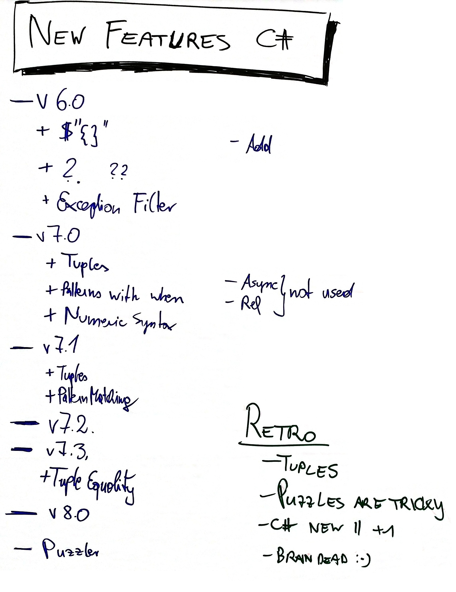

# C# Features and Puzzler Collection

## New Features of C\#

### New Features of C# 6.0

* https://docs.microsoft.com/en-us/dotnet/csharp/whats-new/csharp-6

### New Features of C# 7.0 thru C# 7.3

* https://docs.microsoft.com/en-us/dotnet/csharp/whats-new/csharp-7
* https://docs.microsoft.com/en-us/dotnet/csharp/whats-new/csharp-7-1
* https://docs.microsoft.com/en-us/dotnet/csharp/whats-new/csharp-7-2
* https://docs.microsoft.com/en-us/dotnet/csharp/whats-new/csharp-7-3
* https://github.com/dotnet/try-samples/tree/master/csharp7

### New Features of C# 8.0

* https://docs.microsoft.com/en-us/dotnet/csharp/whats-new/csharp-8
* https://github.com/dotnet/try-samples/tree/master/csharp8

## C# Puzzlers

    Puzzlers: An exploration of "traps, pitfalls and corner cases".
    "A comprehensive catalog of computational conundrums that
    will both perplex and please the perspicacious programmer." (Gilad Bracha)
    Puzzles that shine light into the language's dark, quirky corners.

### Thomas Levesque C# Puzzle

* https://thomaslevesque.com/2015/03/10/c-puzzle-1/ - Declare and initialize x and y.
* https://thomaslevesque.com/2015/07/30/c-puzzle-2/ - Declare and initialize x and y.

### Bob Nystrom named parameters puzzle

* https://twitter.com/munificentbob/status/1027932036118372352

### Eric Lippert "is" Operator Puzzle

* https://blogs.msdn.microsoft.com/ericlippert/2012/08/23/an-is-operator-puzzle-part-one/
* https://blogs.msdn.microsoft.com/ericlippert/2012/08/27/an-is-operator-puzzle-part-two/

### Eric Lippert and Neal Gafter C# Initializer Puzzle

* https://hmemcpy.com/2010/07/csharp-puzzle-what-does-this-program-do/ - What is the output?

### csharp-puzzlers

https://github.com/EngineerSpock/csharp-puzzlers

* no description, no solution.
  * EvilStructs
  * Wagner
  * Dynamic
  * Generic

### ProblemBook.NET

https://github.com/AndreyAkinshin/ProblemBook.NET/blob/master/en/INTRODUCTION.md

* many problems with solutions.

### Columns

* Eric Lippert, https://blogs.msdn.microsoft.com/ericlippert/
